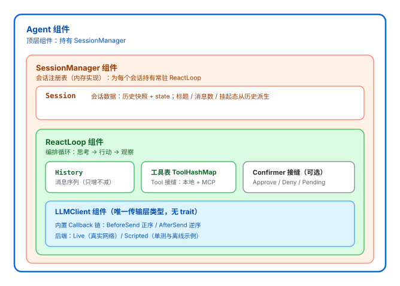

# 顶层组件

crate 根下的顶层组件：把「一段消息进、一条回复出」的传输层，逐级组合成「多轮会话 + 审批挂起恢复」的顶层 `Agent`。纵向分四层，另有 `rag` 作为并列的独立切片：

```
runtime（顶层 Agent）
  └── session（会话注册表：每个 session 一个常驻 ReactLoop）
        └── react（ReAct 循环：思考 → 行动 → 观察）
              └── llm（传输层：LLMClient，唯一具体类型）
rag 并列存在，尚未接入循环
```

## 关系



```
src/
├── llm/           # 传输层：LLMClient + 回调接缝 + provider / semaphore / test_support
├── react/         # 编排层：ReactLoop / History / 审批闸门 / 运行上下文
├── session/       # 会话层：SessionManager + 每会话一个常驻 ReactLoop
├── runtime.rs     # 顶层：Agent / AgentBuilder / Console
├── rag/           # 独立切片：Embedder / InMemoryStore / Retriever（说明见 rag/README.md）
└── assets/        # 本 README 的插图（containment.svg）
```

| 位置 | 关键类型 | 职责 |
|---|---|---|
| `llm/models.rs` | `LLMClient` | **唯一**的传输层类型（无 trait）。`complete`（一次性）/ `stream`（逐 token 回调）；请求级 `ToolPolicy`（`Auto` / `Required` / `Force`）；端点 400 拒绝 `tool_choice` 时粘性降级为 `Auto` 并重发一次 |
| `llm/callback.rs` | `Callback` · `CallbackEvent` | 请求前后回调链：`BeforeSend` 正序、`AfterSend` 逆序（洋葱模型），经 `LLMClient::with_callbacks` 挂载 |
| `llm/provider.rs` | `client_config` · `model_id` | provider 选择、模型 ID / token 上限读取（另有 embedding 专用配置） |
| `llm/semaphore.rs` | `get_semaphore` | 进程级并发闸门（3 permits），**由调用方获取** |
| `llm/test_support.rs` | `Scripted` · `ScriptedRequest` | 脚本化后端与请求快照；`LLMClient::scripted(replies)` 挂载，供单测与离线示例 |
| `react/runner.rs` | `ReactLoop` | 循环推进、工具派发、终止判定、撞上限的软收尾、危险工具的审批闸门 |
| `react/history.rs` | `History` | 消息序列（`system` / `user` / `assistant` / `tool`）；只增不减 |
| `react/models.rs` | `Step` · `Termination` · `Outcome` | 编排层词汇；`DEFAULT_MAX_TURNS` 也在这里 |
| `react/approval/` | `Confirmer` · `Decision` | 工具执行前的确认接缝：`Confirmer` 是扩展点（trait），内置 `TerminalConfirmer`；`Approve` / `Deny` / `Pending` |
| `react/context.rs` | `ExecuteContext` · `Event` | 运行上下文：唯一 ID、`Status` 流转、逐轮事件流；`observe()` 序列化进 tracing |
| `session/manager.rs` | `SessionManager` · `InMemorySessionManager` · `SessionRuntimeConfig` | 会话注册表：为每个会话持有常驻 `ReactLoop`，维护挂起标记与恢复游标 |
| `session/models.rs` | `Session` · `SessionSummary` | 会话数据与摘要；标题 / 消息数 / 挂起态都从历史**派生** |
| `runtime.rs` | `Agent` · `AgentBuilder` · `Console` | 顶层组件：组装 `SessionManager` 并对外委派；`Agent::run` 是交互循环，I/O 经 `Console` 挡在库外 |
| `rag/` | `Embedder` · `InMemoryStore` · `Retriever` | 检索垂直切片，只与 `llm::provider` 的配置函数有交集；未接入循环 |

## 依赖与交互

依赖是单向的（上层依赖下层，`llm` 不反向依赖任何编排 / 会话类型）：

```
runtime ──▶ session ──▶ react ──▶ llm
                           │
                           └──▶ tools（ToolHashMap / Tool::execute）

rag  ──▶ llm::provider（只借配置函数，无对话路径）
gaia ──▶ react + llm::provider（带工具模式）；直答模式绕过 LLMClient
```

### 一轮 ReAct（核心链路）

1. `ReactLoop::run` 把 `History::as_slice()` 与工具表交给 `LLMClient::stream(...)`，策略 `ToolPolicy::Required`；
2. `LLMClient` 先克隆并正序派发 `BeforeSend`（裁剪 / 注入，**不落历史**），再交给后端（真实 `Live` 或脚本化 `Scripted`），拿到回复后逆序派发 `AfterSend`（可改写回复，**会落历史**）；
3. `Reply` 回到 `ReactLoop`：`final_answer` 参数合法 → 立即交付（`Termination::FinalAnswer`）；纯文本降级 → `ModelFinished`；
4. 其余 `tool_call` 逐个走 `Step::Action` → 审批闸门（策略判 `ask` 时经 `Confirmer`）→ `Tool::execute` → `Step::Observation` 回填 `History`；工具失败 / 未知工具 / 拒绝都压成 Observation，不中断循环；
5. 回到第 1 步；跑满 `max_turns` 由 `finalize()` 软收尾（裁工具面 + `Force(final_answer)`，绝不报错）。

> 循环语义与陷阱详见 [`react/README.md`](react/README.md)；回调接缝的语义详见 [`architecture.md`](../.claude/rules/architecture.md) 第 10 节。

### 多轮会话与审批挂起

- `Agent::send` 委派 `SessionManager`：查 / 建会话 → 取常驻 `ReactLoop`（冷启动用 `from_history` 恢复）→ 跑一轮 → 回写 `History` 快照与 `state`；
- 策略判 `ask` 而没有注入 `Confirmer`（或 `Confirmer` 返回 `Pending`）→ 本轮以 `Termination::Suspended` 正常结束，历史停在未配对的 `tool_call` 上；
- `Agent::pending` 查看待审内容，`Agent::resume(decision)` 从中断处继续；挂起可无限期，期间不影响其它会话；
- `Agent::run(&mut dyn Console)` 是交互式循环（`/sessions` `/switch` `/delete` `/resume`），示例见 `examples/react_chat.rs`。

### 离线测试路径

单测与离线示例走同一个接缝：`LLMClient::scripted(replies)` 挂脚本化后端，`scripted_requests()` 取每次请求快照（消息 / 工具名 / `ToolPolicy`），配合 `Callback` 可以完整验证「发出去的 ≠ 存下来的」。

## 与仓库其它组件的关系

| 组件 | 关系 |
|---|---|
| `src/tools/` | 工具层，被 `react` 执行（`ToolHashMap` → `Tool::execute`）；`llm` 只借它把工具表序列化成请求里的 function 定义 |
| `src/settings.rs` | `ApprovalPolicy` 的来源；`ReactLoop` 自己不读文件，加载是调用方的职责 |
| `src/gaia/` | 评测切片：带工具模式经 `solver` 建 `ReactLoop`；直答模式不走 `LLMClient` |
| `src/constant/` | `SYSTEM_PROMPT` 等常量 |
| `src/bootstrap.rs` | `init()`：dotenv + tracing 的统一初始化入口 |
| `src/main.rs` · `src/bin/gaia.rs` · `examples/` | 可执行目标与示例；运行方式见仓库根 `README.md` |

## 关键约定

- **唯一传输层类型**。没有 `Completer` trait，也没有装饰器类型：回调链与脚本化后端都收在 `LLMClient` 内部；不注册回调时全链路与没有这层逐字节一致。
- **单向依赖**。`runtime → session → react → llm`；`llm` 依赖具体领域类型或反向引用都会破坏离线测试与分层。
- **闸门与重试在调用方**。并发限流（`llm::semaphore`）与重试（`backon`，目前只有 GAIA 用）都不内置在传输层。
- **`rag` 未接入循环**。当前是并列切片，未来可作为工具 / 观察通道。

## 测试

```bash
cargo test --all-targets        # 全部离线单测 + 所有 target 编译
cargo test --lib -- --ignored   # 需要外部环境的用例（假 MCP server / embedding 端点）
```

各层细节：`react/README.md`、`rag/README.md`、`.claude/rules/architecture.md`、`.claude/rules/rust-conventions.md`。
