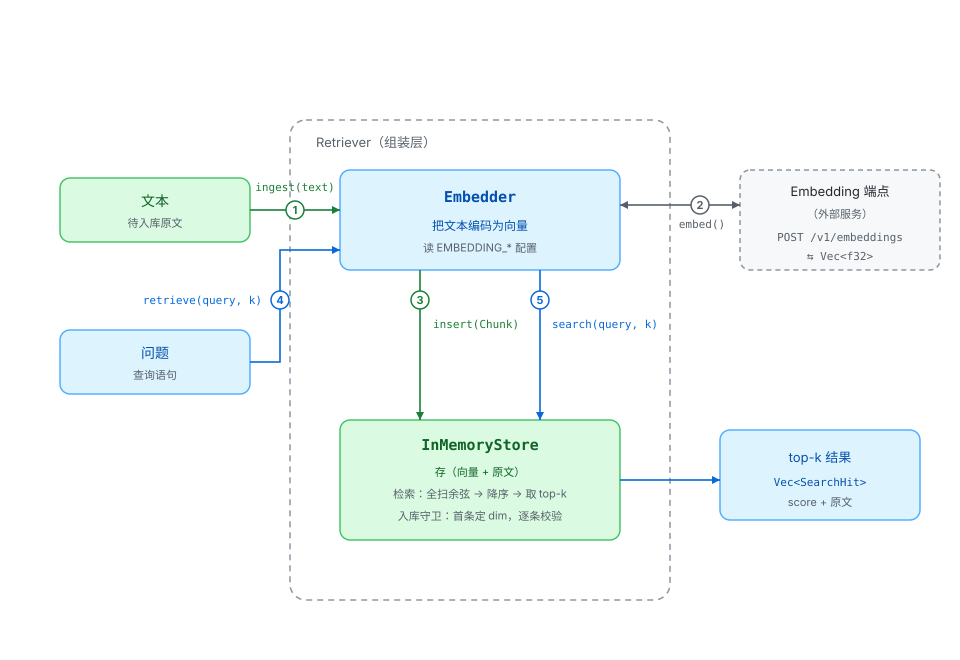

# RAG 模块

检索增强（Retrieval-Augmented Generation）的垂直切片：文本经 embedding 模型转成向量存起来，查询时用同一模型把问题转成向量，按相似度取回最相关的原文。

## 组件

| 组件 | 位置 | 职责 |
|---|---|---|
| `Embedder` | `embed.rs` | 文本 → `Vec<f32>`。一次请求一条文本，取响应的第一条向量。构造时读 `EMBEDDING_*` 环境变量，端点走 `llm::provider` 的 `embedding_client_config()` |
| `InMemoryStore` | `store.rs` | 存 `Chunk { vector, text }`。`insert` 做维度守卫；`search` 全扫余弦、降序取 top-k，返回 `SearchHit { score, text }` |
| `Retriever` | `retriever.rs` | 组装层，把上面两者收口成两个方法：`ingest(text)` = 嵌入 + 入库；`retrieve(query, k)` = 嵌入 + 检索 |

模块外的配套：

| 位置 | 用途 |
|---|---|
| `src/constant/embedding.rs` | 三个环境变量名的常量：`EMBEDDING_API_BASE_URL` / `EMBEDDING_API_KEY` / `EMBEDDING_MODEL_ID` |
| `src/agent/llm/provider.rs` | `embedding_model_id()` 与 `embedding_client_config()`：embedding 专用的配置读取与客户端构造 |

## 交互流程

对应上图编号：

**入库**

1. `Retriever::ingest(text)` —— 文本交给组装层
2. `Embedder::embed(text)` —— HTTPS 调 embedding 端点，拿回该文本的向量
3. 向量与原文合成 `Chunk`，`InMemoryStore::insert` 校验维度后入列

**检索**

4. `Retriever::retrieve(query, k)` —— 问题交给组装层
5. 查询同样走 `embed`（步骤 2，与入库共用同一模型），再 `InMemoryStore::search`：对每条 `Chunk` 算余弦相似度，降序取前 k 条，返回 `score + 原文`

## 关键约定

- **入库与查询必须同一模型**。两侧向量要落在同一向量空间；中途更换 `EMBEDDING_MODEL_ID` 而沿用旧数据，就是拿错尺子量——分数全是噪音且不会报错，只能重建索引。
- **维度守卫**。首条入库的向量定下 `dim`，此后 `insert` 与 `search` 都校验。缺了这道守卫，`zip` 对不等长切片会静默截断，相似度算错而无任何提示。
- **余弦而非欧氏距离**。文本 embedding 按余弦训练；零向量返回 `0.0`，避免 NaN 流入排序（排序用 `total_cmp`）。
- **「向量 → 原文」不是逆变换**。Embedding 不可逆，能取回原文靠的是入库时存下的 `(向量, 原文)` 关联。

## 当前边界

- 无切块：长文整条嵌入，受 embedding 模型输入长度上限约束
- 无持久化：`InMemoryStore` 在进程内，退出即丢
- 无 trait 接缝：换 sqlite-vec / Qdrant 时改的是 `insert` / `search` 两个方法的实现；给 `Retriever` 补离线测试需先引入 embedding trait 与假实现
- 未接入 ReAct 循环：未来可作为工具/观察通道

## 环境变量

| 变量 | 必需 | 说明 |
|---|---|---|
| `EMBEDDING_API_BASE_URL` | 是 | OpenAI 兼容的 embedding 端点 |
| `EMBEDDING_API_KEY` | 是 | 端点认证 |
| `EMBEDDING_MODEL_ID` | 是 | 不设默认值，与端点强绑定 |

## 测试

- 离线：`cargo test --lib` —— `store.rs` 的单测覆盖余弦五态（相同/平行/正交/相反/零向量）、维度守卫、排序与 top-k 边界
- 真实端点：`cargo test --lib -- --ignored` —— `embed.rs` 的 `embeds_text_against_a_real_endpoint`，需要 `EMBEDDING_*` 凭证
