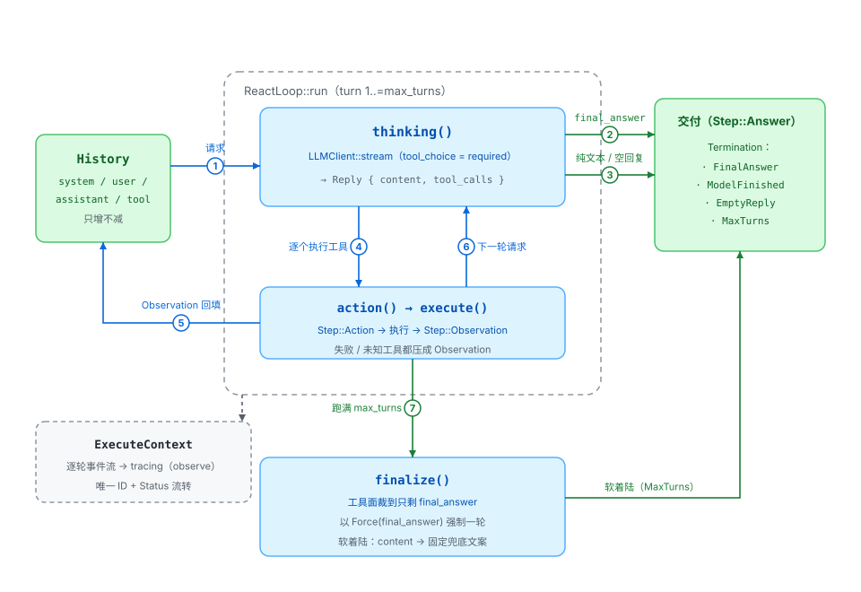

# ReAct 模块

ReAct（Reason + Act）主循环的垂直切片：思考 → 行动 → 观察，循环直到模型交付答案。循环内每轮 `tool_choice = required`，模型只能通过调用 `final_answer` 结束；撞轮次上限时软收尾强制交付，而不是报错退出。

这是全仓库唯一实现「请求 → 工具调用 → 回填 → 再请求」的地方。编排层只依赖 `llm::models::LLMClient` 这**一个具体类型**（无 trait），因此全部逻辑可离线测试。

## 组件

| 组件 | 位置 | 职责 |
|---|---|---|
| `ReactLoop` | `runner.rs` | 循环推进、工具派发、终止判定、撞上限的软收尾、危险工具的审批闸门。`run` 同时接收 `on_step` 与 `on_token` 两个回调 |
| `History` | `history.rs` | 消息序列的薄封装：`system` / `user` / `assistant` / `tool` + `as_slice` |
| `Step` / `Termination` / `Outcome` | `models.rs` | 编排层词汇：轨迹事件、终止原因、运行结果；`DEFAULT_MAX_TURNS = 12` 也在这里 |
| `ExecuteContext` / `Event` | `context.rs` | 执行上下文：唯一 ID、`Status` 流转、当前轮事件流（`set_turn` 只保留当前轮）；由 `observe()` 逐轮序列化进 tracing |
| `Confirmer` / `ApprovalRequest` / `Decision` | `approval.rs` | 确认接缝：策略判 `ask` 时循环经它拿决定；问谁、怎么问由构造时注入的应答器决定，脚本化模式记录请求快照 |

模块外的配套：

| 位置 | 用途 |
|---|---|
| `src/llm/models.rs` | `LLMClient`（`complete` / `stream`，唯一具体类型，无 trait）与 `ToolPolicy`、`Reply`——编排层唯一依赖的接口；测试接缝是它的脚本化后端（`LLMClient::scripted`，见 `src/llm/test_support.rs`） |
| `src/settings.rs` | `ApprovalPolicy`：`.agents/settings.json`（工作区根目录下）决定**哪些工具要问**；缺文件 = 全放行，加载是调用方的职责 |
| `src/tools/tool.rs` · `src/tools/local/final_answer/` | `Tool` trait；`final_answer` 的 `execute`（输入即输出）与 `extract_answer`（终止判定） |
| `src/tools/mod.rs` | `build_tools*()` 构建出的工具表自带 `final_answer`；手工拼表时必须自行注册 |
| `src/gaia/solver.rs` · `examples/react_chat.rs` | 真实调用方：GAIA 带工具模式（用 `on_step` 统计真实工具调用数）/ 逐轮打印轨迹的演示 |

## 交互流程

对应上图编号：

**每轮循环（turn 1..=max_turns）**

1. 组装请求：`History.as_slice()` + 工具定义，以 `ToolPolicy::Required` 走 `LLMClient::stream`，token 经 `on_token` 实时外发
2. 回复里没有任何 function 调用：`content` 非空视为端点无视了 `required`，按纯文本收尾（`Termination::ModelFinished`）；连 `content` 也空则以 `EmptyReply` 收束
3. 含参数合法的 `final_answer` → 交付（`Termination::FinalAnswer`）。同轮其它调用一律不执行，但**每个** `tool_call` 都补配对 tool 消息（被跳过的写占位说明）
4. 其余调用逐个走 `Step::Action` → 审批闸门（策略判 `ask` 时经 `Confirmer` 拿决定，拒绝直接产出观察文案）→ `execute()` → `Step::Observation`；工具失败、未知工具名、被拒绝都压成观察文案，不中断循环（参数非法的 `final_answer` 也走这条路径，下一轮重试）
5. Observation 回填 `History`（配对 tool 消息，顺序与 `calls` 一致）
6. 进入下一轮（回到步骤 1）

**收尾（跑满 max_turns）**

7. `finalize()`：追加 system 指令、把工具面裁到只剩 `final_answer`、以 `Force(final_answer)` 强制一轮，软着陆交付（`Termination::MaxTurns`）——参数非法、端点无视具名强制、连 `content` 也为空，依次退回 `content` → 固定兜底文案，绝不报错

## 关键约定

- **`execute` 返回 `String` 而不是 `Result`**。成功 / 工具失败 / 未知工具三个分支都产出一条 Observation；改成 `Result` 会逼调用方 `?`，一 `?` 就退化成「循环中止」——那就不是 ReAct 了。
- **每个 `tool_call` 必须有配对的 tool 消息，顺序与 `calls` 一致**。漏掉任何一条，下一轮请求会被 "tool_calls must be followed by tool messages" 拒绝——错误信息不会指向这里。交付路径（步骤 3）与收尾轮（步骤 7）不执行工具，但一样补配对消息。
- **撞轮次上限走软收尾，不 `bail!`**。直接报错会把整轮探索的成果扔掉；收尾的三种失败情形一律软着陆。
- **`final_answer` 是普通可执行工具**，不是 `execute` 之前的特殊分支：它的 `execute` 输入即输出，循环用统一的 action → Observation 路径拿到答案，配对消息天然成立；`extract_answer` / `execute` 都是纯函数，可安全重复调用。
- **循环内每轮 `tool_choice = required`**，`content` 永远只是 thought；端点以 400 拒绝时真实后端置粘性标记、降级为 `Auto` 重发（见 `llm` 模块）。
- **审批闸门在 dispatch 之前**：`action()` 发完 `Step::Action` 后查策略，判 `ask` 时经 `Confirmer` 拿决定；拒绝走与「工具失败 / 未知工具」完全相同的通道（压成 Observation），循环继续、配对消息照常——不变量①②不受影响。策略判 `ask` 但未注入 `confirmer` 时**挂起**（`Termination::Suspended`，与主动返回 `Decision::Pending` 同一条路径）。闸门只按暴露名判 glob，参数级粒度由 `Confirmer` 自己拿 `arguments` 判断；`final_answer` 的交付路径与收尾轮不执行工具，天然豁免。
- **`Step::Thought` 与 `Step::Answer` 互斥**，判据 `calls.is_empty()` 必须先于发射——顺序写反会把最终答案错标成 Thinking。这条由按轮次断言事件序列的测试钉住。
- **流式与「区分思考 / 答案」不可兼得**，这是物理限制：token 到达时，这一轮会不会有 `tool_calls` 还不知道。要逐字输出用 `on_token`（内容统一渲染），要分得清用 `on_step`（整段到达）；`react_chat` 只消费 `on_step`。

## 当前边界

- **无历史截断 / 摘要**：`History` 只增不减，长会话迟早撑爆 context——目前最大的缺口
- 非 function 类型的调用（`Custom` 等）无法执行也无法回填，直接过滤并告警
- 请求内容不是严格可复现的：工具定义按 `ToolHashMap` 迭代顺序收集，`HashMap` 顺序不保证；要复现需先按名字排序
- 收尾轮的 token 标 `max_turns + 1`（真实请求序号），而 `Outcome.turns` 报 `max_turns`——已知的计数口径差异
- `LLMClient` 调用不带重试；给流式加重试会重放已打印的输出（见 `llm` 模块）

## 测试

- 离线：`cargo test --lib` —— `runner.rs` 21 个覆盖循环逻辑：交付三态（参数即答案 / 与兄弟调用并存 / 消息全配对）、降级路径（纯文本 / 空回复 / 端点无视强制）、工具失败与未知工具压成 Observation、`final_answer` 参数非法重试、撞上限的强制收尾与工具面裁剪、软着陆三态、`Step` 发射顺序、审批闸门四态（拒绝压成 Observation 且不执行 / 批准照常执行 / 无 confirmer 时挂起 / allow 不咨询 confirmer）
- `settings.rs` 11 个：配置解析（完整 / 空对象 / 默认值 / 非法 action / 空 pattern 拒绝 / 未知字段拒绝 / 缺文件回退）与匹配表（精确、前后缀通配、裸 `*`、首行锚定、规则顺序、`defaultAction` 回退）
- `context.rs` 6 个：唯一 ID、状态流转、事件序列化（平铺 JSON、毫秒时间戳）、`set_turn` 只留当前轮、插入顺序
- 接缝：`LLMClient::scripted` 的脚本化后端（预置响应队列，同时记录策略、工具面与消息）+ `EchoTool` + `Confirmer::scripted`（预置决策队列，`scripted_requests()` 取回请求快照）替掉真实网络与人工输入，全部离线
