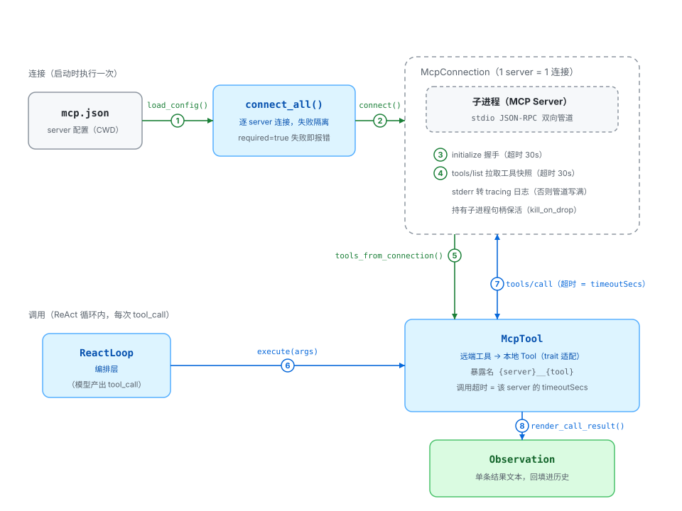

# MCP 模块

把外部 MCP server 经 **stdio** 接进工具层的垂直切片：启动子进程 → `initialize` 握手 → `tools/list` 发现工具 → 适配成本项目的 `Tool`；模型每次工具调用即一次 `tools/call`。一期只实现 **stdio 传输**与 **tools 能力**。

角色对应 MCP 规范：本项目是 Host；每个 `McpConnection` 是一个 MCP Client；被启动的子进程是 MCP Server。

## 组件

| 组件 | 位置 | 职责 |
|---|---|---|
| `McpConfig` / `McpServerConfig` / `load_config` | `config.rs` | 读取并校验 `mcp.json`：`deny_unknown_fields` + 语义校验（server 名字符集、`command` 非空、超时 > 0）。文件不存在视为未启用 MCP，返回空配置 |
| `McpConnection` / `connect` / `connect_all` | `connection.rs` | 启动子进程、完成 stdio 握手与 `tools/list`；`connect_all` 按 `required` 做失败隔离；持有子进程句柄保活 |
| `McpTool` / `tools_from_connection` | `tool.rs` | 远端工具 → 本地 `Tool` 适配：命名校验、`tools/call` 调用、`CallToolResult` 降维成单条文本 |



模块外的配套：

| 位置 | 用途 |
|---|---|
| `src/tools/mod.rs` | `build_tools()`：读 `mcp.json` → `connect_all()` → `tools_from_connection()`，与本地工具合并进 `ToolHashMap`。本地先注册，重名时本地优先、MCP 工具跳过告警；`build_tools_with(config)` 是不读文件的测试接缝 |
| `tests/fixtures/fake_mcp_server.py` | 手写裸 JSON-RPC 的最小 server（`echo` / `add` / `fail`），集成测试用 |
| `examples/` 下 `mcp_probe` · `mcp_react` · `mcp_chat` | 探针 / 脚本化模型端到端 / 真实 LLM 自主调用 |
| 仓库根 `README.md` | `mcp.json` 的用户向格式与错误语义说明 |

## 交互流程

对应上图编号：

**连接（启动时，一次）**

1. `load_config()` —— 读当前工作目录下的 `mcp.json` 并校验；文件不存在 = 未启用 MCP，配置非法则直接报错
2. `connect()` —— 为每个 server 启动子进程：stdin / stdout 作通信管道，stderr 交给转发 task
3. `initialize` 握手（超时 30s）
4. `tools/list` 拉取工具快照（超时同上）
5. `tools_from_connection()` —— 每个远端工具适配为 `McpTool` 注册进工具表；名字非法或超长的跳过并告警

**调用（ReAct 循环内，每次 tool_call）**

6. `execute(args)` —— 参数校验（空串视为无参；必须是 JSON 对象）后发起调用
7. `tools/call` —— 经 stdio 发给子进程，超时 = 该 server 的 `timeoutSecs`
8. `render_call_result()` —— 把 `CallToolResult` 降维成单条文本，作为 Observation 回填历史

## 关键约定

- **工具级错误不返回 `Err`**。`isError = true` 的结果照样渲染成 `Ok(文本)`，让模型看到错误内容自己纠错；只有协议 / 传输 / 超时错误才是 `Err`，再由 ReAct 循环压成 Observation。
- **名字必须合法**。暴露名 `{server}__{tool}` 必须满足 OpenAI function 名规则 `^[a-zA-Z0-9_-]{1,64}$`——一个非法名会让整个 `ReactLoop::new` 失败，所以在适配期就校验并跳过；server 名同理，在配置校验期限制字符集。
- **必须持有子进程句柄**。`McpConnection` 的 `_child` 字段是 keep-alive 的关键：命令设了 `kill_on_drop(true)`，drop 掉 `Child` 会立刻杀掉刚建好的子进程。`McpTool` 持 `Arc<McpConnection>`，连接因此活到工具表生命周期的尽头。
- **stderr 必须持续读**。有专门的 task 逐行转发到 tracing；不读的话管道写满会阻塞子进程。
- **两种超时用途不同**。握手 / 发现用固定的 `HANDSHAKE_TIMEOUT_SECS`（30s）；每次 `tools/call` 用 server 配置的 `timeoutSecs`（默认 60s）。
- **失败隔离**。`required = false` 的连接失败只告警跳过；`required = true` 才让整体启动失败；连接成功但 0 工具的 server 会被丢弃并回收子进程。

## 当前边界

- 仅 stdio、仅 tools：不涉及 resources / prompts / sampling / HTTP；client handler 是 `()`，不声明任何反向能力
- 不支持 MRTR（`InputRequired`）与 tasks（`Task`）响应，遇到直接报错
- 工具列表是连接时的快照：不做热刷新，也不重连；子进程异常退出只能在下一次调用时暴露
- 非文本内容（图片 / 音频 / 资源）只留占位摘要，不塞 base64
- `mcp.json` 路径写死当前工作目录，不支持环境变量覆盖

## 配置文件（`mcp.json`）

| 字段 | 必需 | 默认 | 说明 |
|---|---|---|---|
| `command` | 是 | — | 可执行文件（`npx` / `uvx` / 绝对路径）；空串报错 |
| `args` | 否 | `[]` | 命令行参数 |
| `env` | 否 | `{}` | 追加 / 覆盖到继承的父进程环境之上 |
| `cwd` | 否 | 父进程当前目录 | 子进程工作目录 |
| `required` | 否 | `false` | `true` 时该 server 连接失败让整体启动失败 |
| `timeoutSecs` | 否 | `60` | 每次 `tools/call` 的超时，必须大于 0 |

```json
{
  "mcpServers": {
    "filesystem": {
      "command": "npx",
      "args": ["-y", "@modelcontextprotocol/server-filesystem", "/tmp"]
    }
  }
}
```

配置开了 `deny_unknown_fields`：字段名拼错（如把 `args` 写成 `arg`）会在启动时立即报错，而不是被静默忽略。server 名只能含字母、数字、下划线和连字符——它会参与拼装 function 名。

## 测试

- 离线：`cargo test --lib` —— `config.rs` 覆盖解析、默认值、非法字段 / 名字 / 超时的拒绝与缺文件回退；`tool.rs` 覆盖结果映射（多文本块 / 占位符 / 结构化回退 / 空结果）、参数解析与命名校验；`connection.rs` 覆盖 `Send + Sync`、空配置与 `required` 两态失败隔离
- 本地集成：`cargo test --lib -- --ignored` —— MCP 相关 3 个测试用 `tests/fixtures/fake_mcp_server.py`（需本机 `python3`）：真实工具发现、适配器端到端调用（含 `isError` 路径）、工具表注册后连接仍存活
